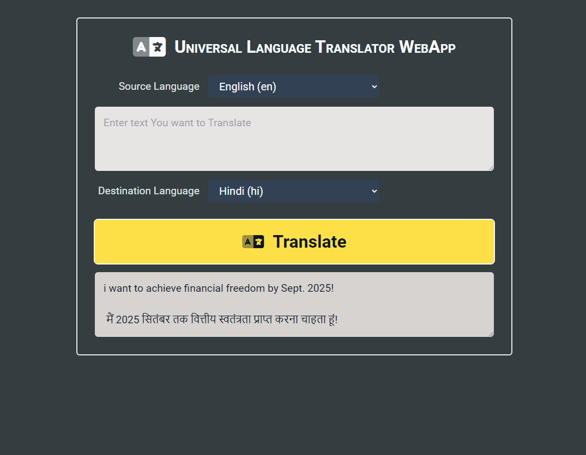

# Module#5 React Day #10 Homework: Universal Language Translator WebApp


## Hosted Version of the Project:
[m5react-day-10-homework-universal-language-translator-webapp](https://m5react-day-10-homework-universal-language-translator-webapp.vercel.app/)

## Objective
+ The Universal Language Translator is an innovative and user-friendly web application designed to seamlessly translate text from one language to another. This project employs an API-based approach to provide accurate and efficient language translation services.
+ **Language Selection**: Users can choose both the source and target languages from a comprehensive list of supported languages. This flexibility allows the application to cater to a wide range of linguistic preferences.
+ **User Input**: A simple and intuitive user interface allows users to input the text they wish to translate. Whether it's a sentence, paragraph, or document, the Universal Language Translator can handle various lengths of text.
+ **Translation on Demand**: Upon entering the text, users can initiate the translation process with a single click on the 'Translate' button. The application will then communicate with the chosen API to convert the text from the source language to the selected target language.
+ **API Integration**: The project leverages a reliable and efficient language translation API to ensure the accuracy and quality of translations. The chosen API should support a wide array of languages and offer real-time translation capabilities.


## How to install and run in yours local machine
```bash
npm install
npm run start
```

## Tech. Stack Used:
+ [React](https://react.dev/)
+ [TailwindCSS](https://tailwindcss.com/)
+ [Google Fonts](https://fonts.google.com/)
+ [Font Awesome](https://fontawesome.com/icons/)

## Important 
You need to create an `.env` file in the root containing Rapid API Key.
Yours .env file should look like this
```
REACT_APP_X_RAPIDAPI_KEY_TEXT_TRANSLATOR2_BY_DICKYAGUSTIN=YoursApiKey

```
### How to get yours API Key
Now to get that API Key, you need to signup & subscribe to [Rapid API Text Translator 2](https://rapidapi.com/dickyagustin/api/text-translator2) and inside settings you will get yours token.
while deploying yours app to [Vercel](https://vercel.com/) you need to specify these Enviornmnet variables inside settings.

### Why i did this?
to protect my API Key from aunthorized activity! 

## Author
[Abhishek kumar](https://www.linkedin.com/in/alex21c/), ([Geekster](https://geekster.in/) MERN Stack FS-14 Batch)

